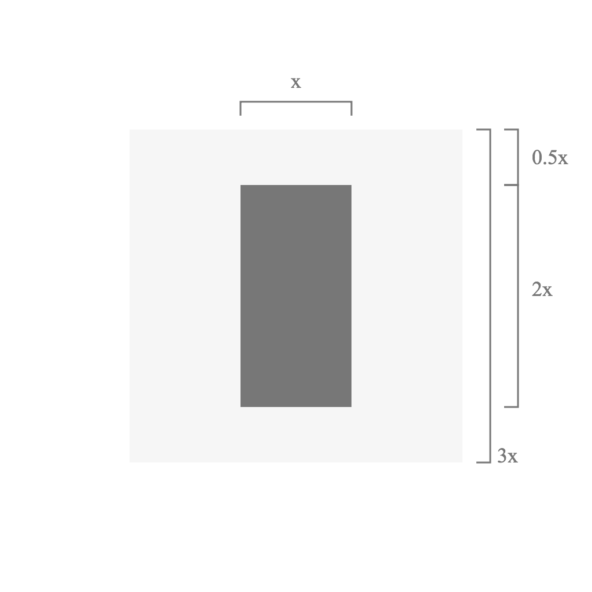
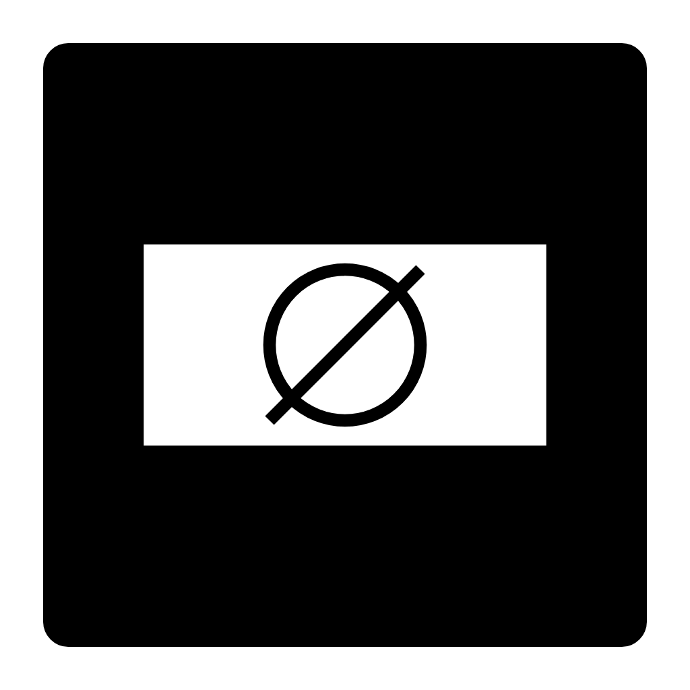
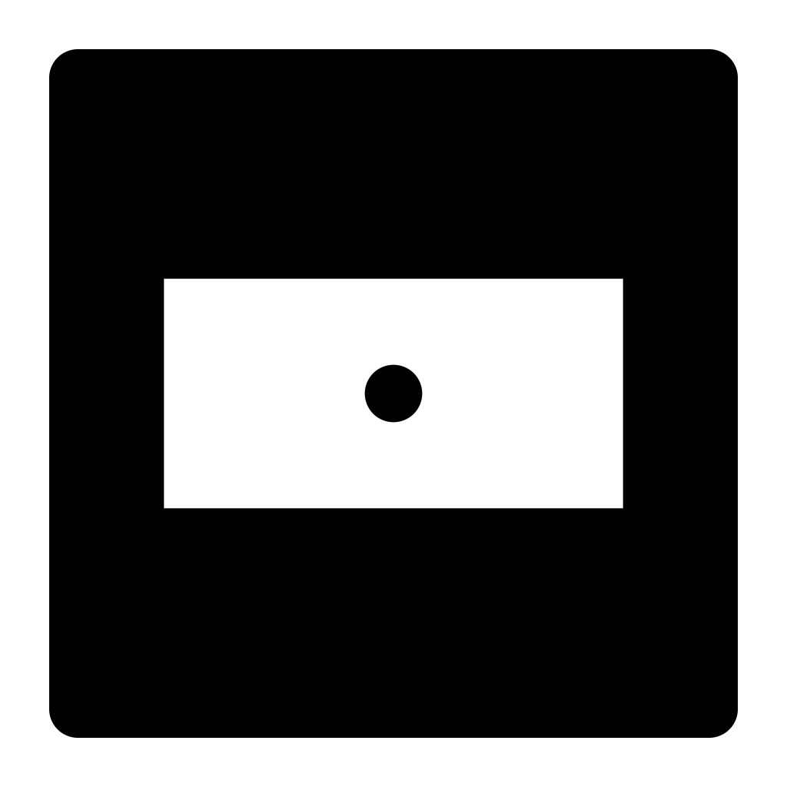

# Logo


The Compositor logo, also known as the *sort* or the *block* is composed of a vertical rectangle within a clear space square.
Because the clear space is included in the logo itself, no additional space needs to be added around the logo in use.

## Ratios



The inner rectangle has a 2:1 ratio.
The space to the left and right of the rectangle is equal to its width, and the top and bottom spacing is equal to half its width.
The logo can be evenly divided into a 6x6 grid.

## Motif

The logo's grid and proportions can be used as a design motif for creating layouts.

## Color

The primary Compositor color palette is pure black and white.
This allows for user generated content to stand out against the unobtrusive and subdued tone of Compositor's branding.
Other colors can be introduced when needed.

## Product Icons




Product icons can be based on the logo's dimensions in a horizontal format.
In order to support a family of related products, the icons should follow a similar layout,
but can also branch out into product-specific brand colors to help differentiate themselves.

## React Components

The logo and app icons are SVGs, designed and built in React.
Repng can be used to export the icons into PNG format.
React DOM can be used to render SVGs.
Because the logo is built with React, the product icons can literally be composed with the Logo component.

```js
<Logo
  color='white'
  backgroundColor='black'
  size={size}
  radius={1}
  horizontal>
    <g fill='none'
      stroke='black'
      strokeWidth={strokeWidth}>
      <path d={paths.x} />
      <path d={paths.o} />
    </g>
</Logo>
```

## Development

```sh
npm i
npm run dev
```

